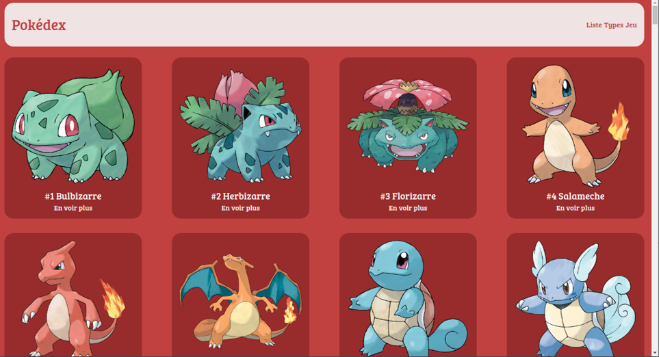
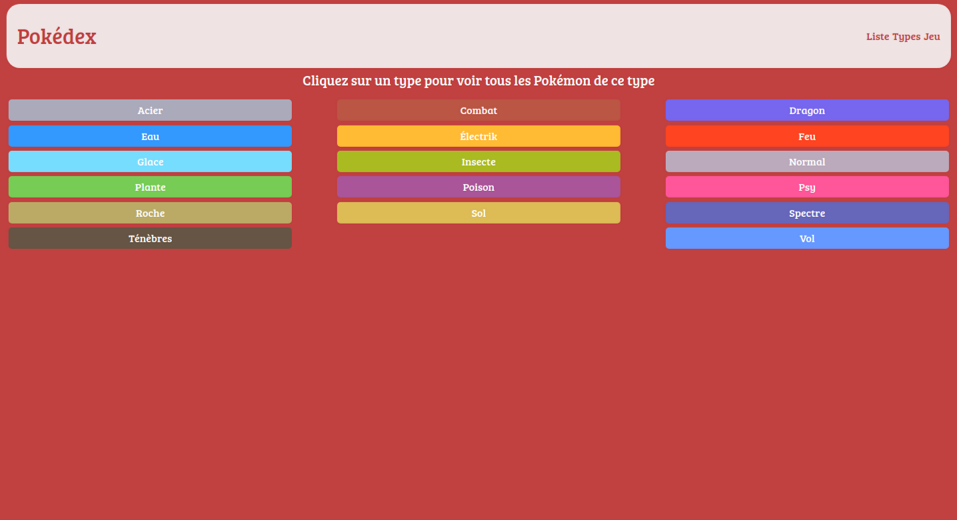
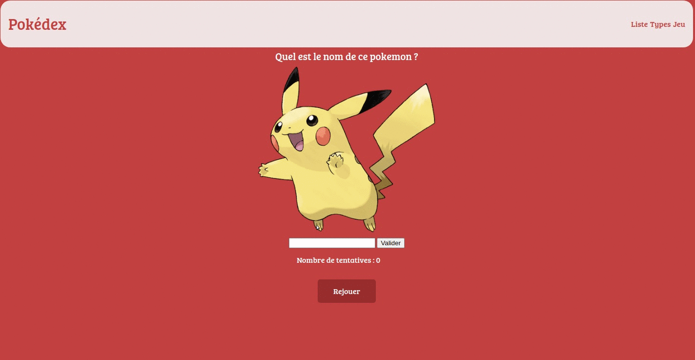

# 2021-S04-Pokedex

## Description
Display of all pokemon in BDD.
A game is available to guess Pokemon's name.

Using EJS, one branch with classical datamapper, one branch using ORM Sequelize

## How to start ?

1. Create a BDD
2. Create your .env with BDD path
3. Run SQL script in app/data/pokedex.sql
4. npm i 
5. npm start

## How does it look ?

